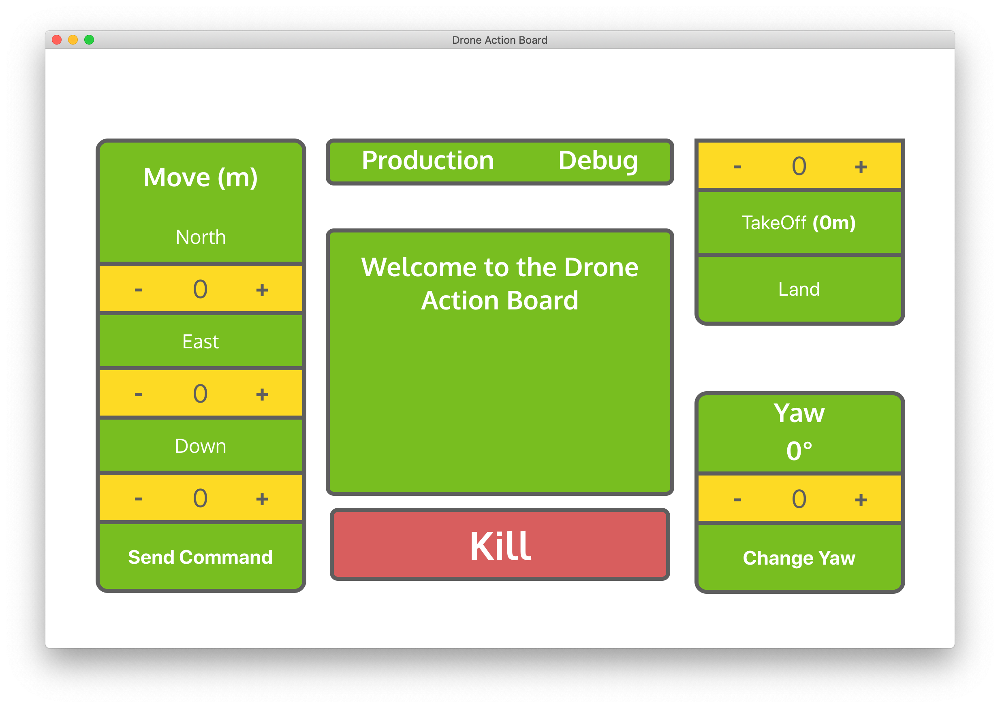

# Drone Action Board

Desktop app used to send commands and enable autonomous features for custom-built drones by Missouri S&T's Multirotor Design Team.  
Built with React on top of Electron with Node being used to send TCP network commands to the Multirotor Team's python server in order to communicate with the drones.

Has a debug/testing mode (as shown above) meant for testing out autonomous commands for the drone, like moving straight for a meter, and a production mode for one-click activation of complex autonomous routines to be used during competition for the _International Aerial Robotics Challenge._

## Setup

Uses yarn as the package manager. Install yarn to your system and type `yarn` to download the dependencies.

Then type `yarn dev` to open up a development preview.
